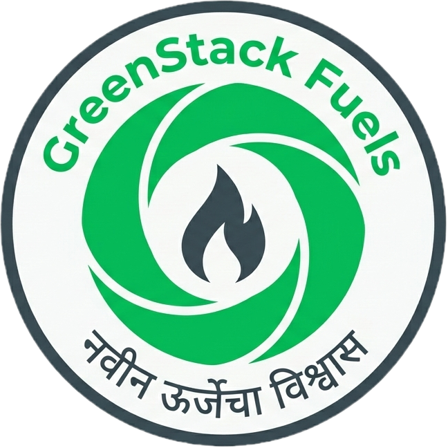

<div align="center">
  
  <h1>GreenStack Fuels</h1>
  <p><strong>नवीन ऊर्जेचा विश्वास | Powering Maharashtra's Industrial Future</strong></p>
</div>

---

## 🌍 About The Project

This is the official pre-launch web portal for **GreenStack Fuels**, Maharashtra's upcoming advanced biomass pellet production hub. 

Designed for B2B industrial procurement managers, this platform serves as a digital prospectus and lead-generation tool. It captures Expressions of Interest (EOI) for bulk supply contracts ahead of the facility's commercial launch in late 2026.

### ✨ Key Features
* **Bento Grid Architecture:** A modern, scannable layout optimized for data-heavy industrial specifications.
* **Glassmorphic UI:** Premium "frosted glass" aesthetic over a dark industrial theme.
* **Dynamic Lead Capture:** Integrated EOI form for capturing pre-launch factory partnerships.
* **Interactive Roadmap:** Live timeline showcasing project development phases.

---

## 🛠️ Technology Stack

This project is built using modern web development standards to ensure maximum speed, SEO performance, and visual fidelity.

* **Framework:** [Next.js (React)](https://nextjs.org/)
* **Styling:** [Tailwind CSS](https://tailwindcss.com/)
* **Animations:** [Framer Motion](https://www.framer.com/motion/)
* **Icons:** [Lucide React](https://lucide.dev/)
* **Deployment Setup:** Static HTML Export (Ready for GitHub Pages/Vercel)

---

## 🚀 Getting Started (Local Development)

To run this website on your own machine, follow these steps:

### 1. Prerequisites
Make sure you have [Node.js](https://nodejs.org/) installed on your computer.

### 2. Installation
Clone this repository and install the dependencies:
```bash
git clone [https://github.com/yourusername/greenstack-fuels-web.git](https://github.com/yourusername/greenstack-fuels-web.git)
cd greenstack-fuels-web
npm install
